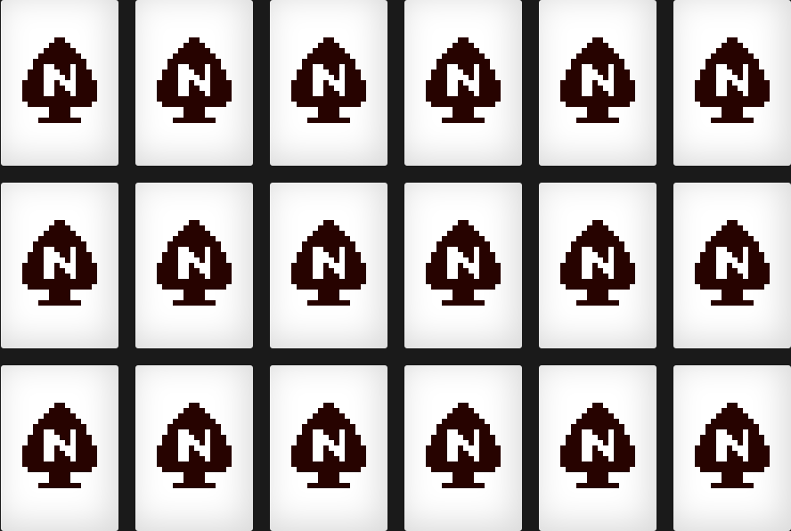

## Table of Contents

* [About the Project](#about-the-project)
* [Roadmap](#roadmap)
* [License](#license)
* [Contact](#contact)

## About The Project

Card memory is a game where you have to click on a card to see what image is underneath it and try to find the matching image underneath the other cards.

This project come from [florinpop17](https://github.com/florinpop17/app-ideas/blob/master/Projects/2-Intermediate/Card-Memory-Game.md)

## Roadmap

See the [open issues](https://github.com/remi-boivin/Card-Memory-Game-js/issues) for a list of proposed features (and known issues).

## License

The project is under GNU, v3.0. For more informations you can read the  [LICENCE.md](https://github.com/remi-boivin/Card-Memory-Game-js/blob/master/LICENSE) for more information about the GNU, v3.0 licence.

## Contact

[remi-boivin](https://github.com/remi-boivin) - [E-Mail](mailto:remi.boivin@epitech.eu)
